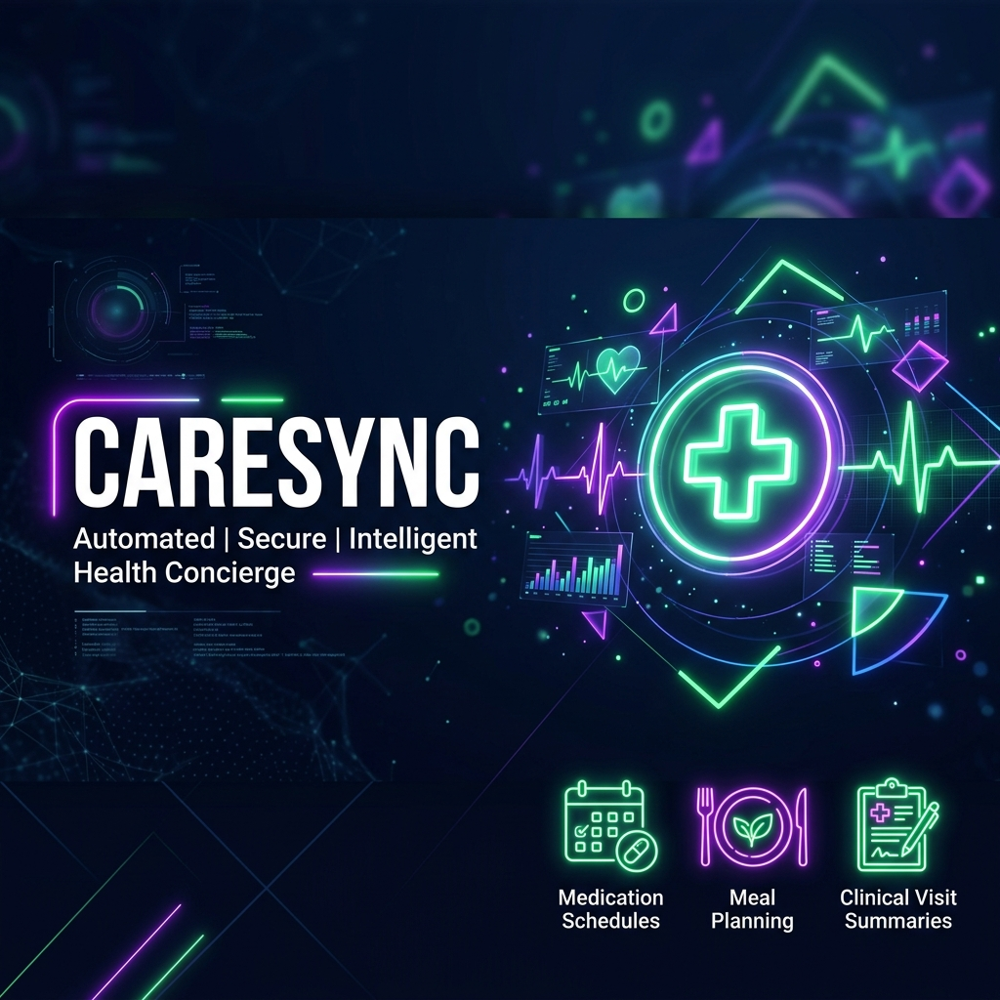
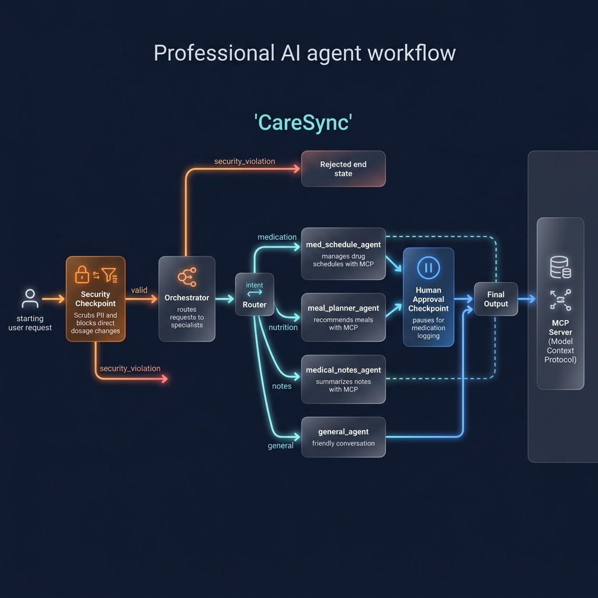
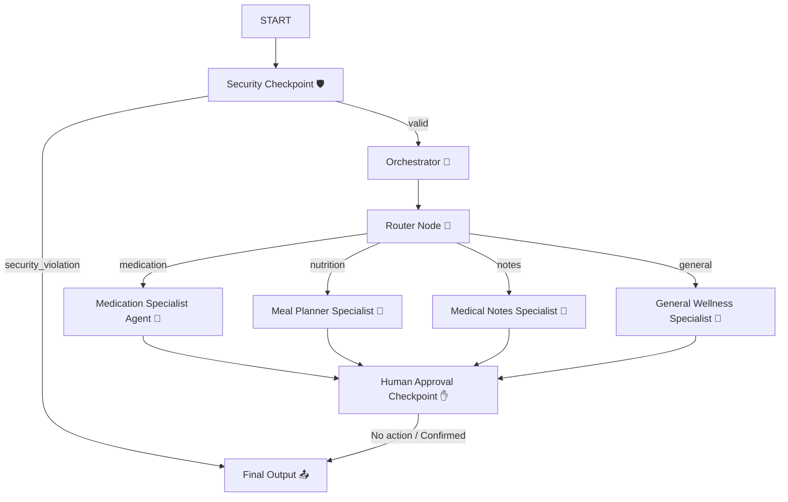

# CareSync — Your Personal Health Concierge 🏥



CareSync is an advanced agentic health concierge designed to help users track medication schedules, summarize medical visit notes, and plan healthy, customized meals. It is built using the **Google Agent Development Kit (ADK) 2.0** and the Gemini API, utilizing a robust, multi-agent graph architecture with strict security guardrails and Human-in-the-Loop safety checks.

---

## Prerequisites
- **Python 3.11+**
- **uv** (fast Python package manager)
- **Gemini API key** from Google AI Studio (Get a key at [aistudio.google.com/apikey](https://aistudio.google.com/apikey))

---

## Quick Start
```bash
git clone <repo-url>
cd caresync
cp .env.example .env   # Add your GOOGLE_API_KEY
make install
make playground        # Opens UI at http://localhost:18081
```

---

## Architecture Diagram
CareSync employs a structured graph-based workflow where specialized sub-agents are implemented as **first-class nodes** rather than simple tools. This allows the system to visually trace the communication flow and display active paths in the playground UI.





---

## How to Run

CareSync supports multiple launch configurations tailored to development and deployment:
- `make playground`: Launces the interactive local testing web interface at **http://127.0.0.1:18081**.
- `make run`: Starts the FastAPI application server (Uvicorn) hosting JSON-RPC and A2A endpoints at port `8000`.
- `make test`: Executes unit and integration test suites using `pytest`.

---

## Sample Test Cases

### 🧪 Test Case 1 — Medication Information Lookups
- **Input:**
  ```text
  What should I know about taking metformin?
  ```
- **Expected:**
  - Evaluated by `security_checkpoint` (verifies it does not contain PII or jailbreaks, passes to `orchestrator`).
  - `orchestrator` outputs `RoutingDecision` selecting `"medication"`.
  - `router` routes query to `med_schedule_agent`.
  - `med_schedule_agent` calls the `get_medication_info` MCP tool and prints side effects/dosage guidelines.
- **Check:**
  - In the playground UI, the execution path lights up showing `START` -> `security_checkpoint` -> `orchestrator` -> `router` -> `med_schedule_agent` -> `human_approval_checkpoint`.
  - The final output displays metformin's safety details.

### 🧪 Test Case 2 — Adding a Medication (HITL Trigger)
- **Input:**
  ```text
  Add Lisinopril 10mg once daily to my medication schedule
  ```
- **Expected:**
  - Evaluated by `security_checkpoint` (valid), passed to `orchestrator`.
  - `orchestrator` selects `"medication"` route.
  - `router` routes to `med_schedule_agent`.
  - `med_schedule_agent` executes the local `save_medication_schedule` tool, adding a pending action to the session state.
  - `human_approval_checkpoint` intercepts the pending action and pauses execution, returning a `RequestInput` confirmation event.
- **Check:**
  - The UI displays: `"✋ CareSync Safety Check: A request was made to add Lisinopril (10mg, once daily) to your medication schedule. Please confirm: 'Yes' to approve..."`
  - Submit `"Yes"` in the text input: the UI displays approval and saves it to state.

### 🧪 Test Case 3 — Meal Plan Planning
- **Input:**
  ```text
  Suggest a low-carb meal plan for me
  ```
- **Expected:**
  - Evaluated by `security_checkpoint` (valid), passed to `orchestrator`.
  - `orchestrator` selects `"nutrition"` route.
  - `router` routes to `meal_planner_agent`.
  - `meal_planner_agent` executes the `get_healthy_recipes` MCP tool, fetches diet details, and formats the meal list.
- **Check:**
  - The UI displays the low-carb menu and recipe guidelines.

---

## Troubleshooting

### 1. `ValueError: No API key was provided.`
- **Reason:** The Gemini SDK did not find `GOOGLE_API_KEY` or `GEMINI_API_KEY` in the environment.
- **Fix:** Ensure you have configured a valid `.env` file containing your key in your active directory.

### 2. `403 PERMISSION_DENIED. {'error': {'code': 403, 'message': 'Your project has been denied access...'}}`
- **Reason:** Telemetry is sending metrics/traces to a Vertex AI project that is not enabled or lacks billing.
- **Fix:** Disable Cloud Agent Engine telemetry in your `.env` file by setting `GOOGLE_CLOUD_AGENT_ENGINE_ENABLE_TELEMETRY=false` and `GOOGLE_GENAI_USE_ENTERPRISE=False`.

### 3. `KeyError: 'Context variable not found'`
- **Reason:** The instructions contain a `{placeholder}` that is not initialized in the session state at start.
- **Fix:** Ensure all state variables are initialized in `security_checkpoint` before specialized agents format their instructions.

---

## Demo Script
A complete spoken narration script for presenting this agent and workflow is available in [DEMO_SCRIPT.txt](DEMO_SCRIPT.txt).

---

## Push to GitHub

1. Create a new repo at https://github.com/new
   - Name: CareSync
   - Visibility: Public or Private
   - Do NOT initialize with README (you already have one)

2. In your terminal, navigate into your project folder:
   cd CareSync
   git init
   git add .
   git commit -m "Initial commit: CareSync ADK agent"
   git branch -M main
   git remote add origin https://github.com/eaugustin320/CareSync.git
   git push -u origin main

3. Verify .gitignore includes:
   .env          ← your API key — must NEVER be pushed
   .venv/
