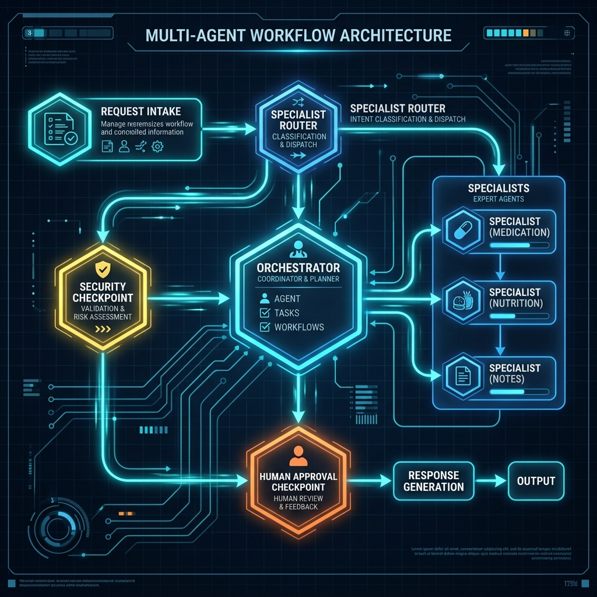
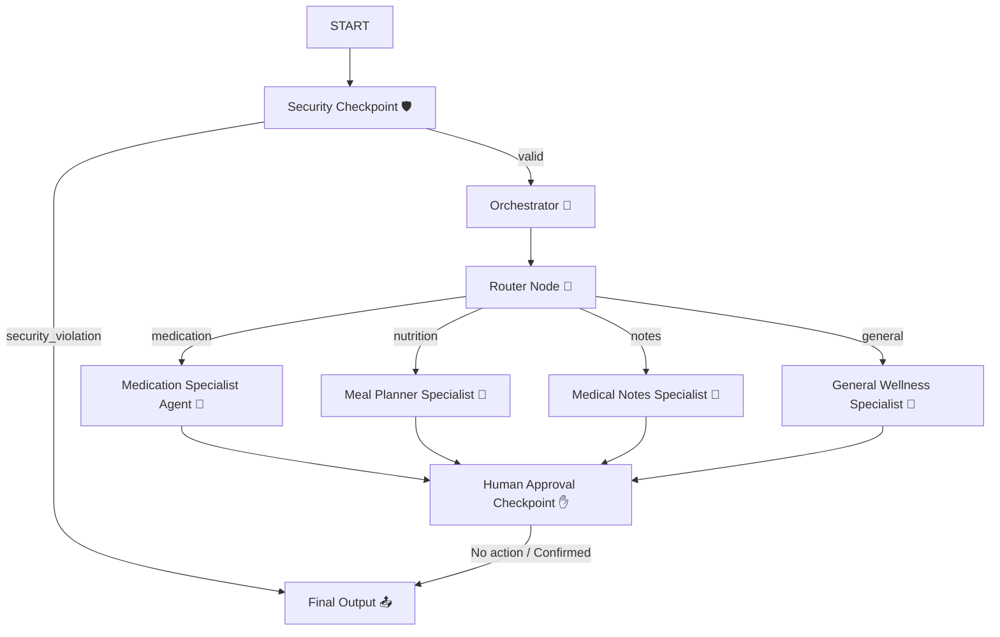

# CareSync Submission Write-Up

## 1. Problem Statement
Managing personal healthcare is often highly disjointed. Patients struggle to track complex medication schedules, parse doctor's visit notes filled with clinical abbreviations, and coordinate dietary menus that align with health conditions. CareSync addresses this real-world need by providing a unified, safety-first health concierge that handles these disparate tasks intelligently.

---

## 2. Solution Architecture
CareSync employs a structured graph-based workflow where specialized sub-agents are implemented as **first-class nodes** rather than simple tools. This allows the system to visually trace the communication flow and display active paths in the playground UI.

---

## 3. Concepts Used

This agentic application leverages several advanced concepts from the **Google Agent Development Kit (ADK) 2.0**:
- **ADK Workflow**: Coordinates the multi-node graph topology in [app/agent.py](file:///c:/Users/DELL/Documents/adk-workspace/caresync/app/agent.py#L274-L294).
- **LlmAgent**: Encapsulates agent instances (Orchestrator and Specialists) in [app/agent.py](file:///c:/Users/DELL/Documents/adk-workspace/caresync/app/agent.py#L62-L120).
- **AgentTool**: Dispatched specialized nodes previously, now adapted to first-class routing via graph edges.
- **MCP Server**: Hosts safety information, healthy recipe lookups, and abbreviation parsers inside [app/mcp_server.py](file:///c:/Users/DELL/Documents/adk-workspace/caresync/app/mcp_server.py).
- **Security Checkpoint**: Evaluates, scrubs, and blocks unsafe requests inside the `security_checkpoint` node in [app/agent.py](file:///c:/Users/DELL/Documents/adk-workspace/caresync/app/agent.py#L125-L195).
- **Agents CLI**: Handles local setup, playground initialization, and deployments (`agents-cli`).

---

## 4. Security Design

We implemented three safety guardrails inside the `security_checkpoint` node to protect patient privacy and safety:
1. **PII Redaction**: Regular expressions strip phone numbers, email addresses, and SSNs from inputs to protect patient identity and comply with privacy standards.
2. **Prompt Injection Mitigation**: Identifies malicious jailbreak phrases (e.g. `"ignore previous instructions"`) and terminates processing to protect LLM state.
3. **Medical Safety Constraint**: Prevents direct dosage adjustments (e.g. `"double my metformin dose"`). The agent blocks these changes and returns a notification urging the patient to consult their doctor first.

---

## 5. MCP Server Design

The Model Context Protocol (MCP) server ([app/mcp_server.py](file:///c:/Users/DELL/Documents/adk-workspace/caresync/app/mcp_server.py)) is implemented using the `FastMCP` framework and offers three tools:
- `get_medication_info(name)`: Returns safety specifications, daily dosage limits, and side effects.
- `get_healthy_recipes(query)`: Recommends recipes aligned with wellness parameters.
- `parse_medical_abbreviations(text)`: Expands clinical abbreviations (like `bid`, `qd`, `prn`) into plain language.

---

## 6. HITL Flow
Medication logging is a high-risk operation. The `human_approval_checkpoint` node acts as a Human-In-The-Loop gatekeeper. When adding a medication:
1. The specialist agent calls the local `save_medication_schedule` tool.
2. The tool sets a `pending_action` inside the session state.
3. `human_approval_checkpoint` intercepts the pending action and pauses execution using ADK's `RequestInput` event, presenting a confirmation message.
4. The medication list is updated only if the user explicitly approves (`Yes` or `Confirm`).

---

## 7. Demo Walkthrough

We validated three core scenarios in the playground:
- **Demo 1 — Medication Query:** The request `"What should I know about metformin?"` is evaluated by `security_checkpoint`, routed to `med_schedule_agent`, which calls the `get_medication_info` MCP tool, and displays side effects and warnings.
- **Demo 2 — Medication Scheduling (HITL):** Sending `"Add Lisinopril 10mg once daily to my schedule"` routes to `med_schedule_agent`, flags the pending log, pauses execution in the UI asking for confirmation, and writes to `medication_list` upon typing `"Yes"`.
- **Demo 3 — Recipe Recommendations:** Sending `"Suggest a low-carb meal plan"` routes to `meal_planner_agent` which executes `get_healthy_recipes` and outlines a low-carb menu list.

---

## 8. Impact & Value Statement
CareSync assists patients, family caregivers, and wellness practitioners by automating administrative medication tracking, summarizing clinical summaries, and generating recipes. This lowers cognitive burden, improves health literacy, and decreases the risk of medication errors.
